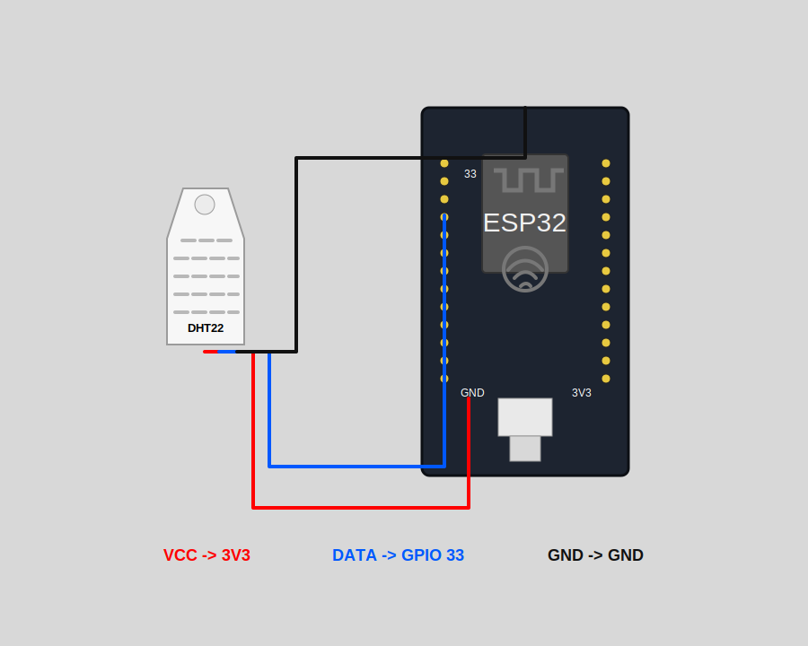

# Smart Home DHT22 Secure Dashboard

Application IoT securisee qui relie une simulation Wokwi ESP32/DHT22 a un dashboard web temps reel via EMQX Cloud et MQTT/TLS.

Le projet montre une chaine complete de supervision Smart Home: acquisition de temperature et humidite, publication MQTT chiffree, backend Node.js, stockage local, interface web protegee et controle des seuils.

## Objectif du projet

Ce projet a ete construit pour superviser a distance les donnees d'un capteur DHT22 dans une maison intelligente. Wokwi simule l'ESP32 et le capteur, puis l'ESP32 publie les mesures vers un broker EMQX Cloud. Le backend Node.js se connecte au broker, recoit les messages MQTT/TLS, les stocke localement et les diffuse au dashboard avec Server-Sent Events.

Le point central du projet est la securite: les secrets MQTT restent cote serveur, l'acces au dashboard exige une authentification forte, les sessions sont signees et les requetes sensibles sont protegees contre le CSRF.

## Architecture

```text
Wokwi ESP32 + DHT22
        |
        | MQTT/TLS 8883
        v
EMQX Cloud Broker
        |
        | MQTT/TLS subscriber
        v
Node.js Backend
        |
        | HTTPS/local HTTP + SSE
        v
Secure Web Dashboard
```

Flux principal:

1. Le capteur DHT22 mesure la temperature et l'humidite.
2. L'ESP32 Wokwi publie un payload JSON sur `smart-home/dht22/telemetry`.
3. EMQX Cloud recoit les messages MQTT via TLS.
4. Le backend Node.js s'abonne aux topics MQTT, normalise les messages et conserve l'historique.
5. Le dashboard affiche les KPI, alertes, statuts, courbe historique et messages bruts.
6. Les seuils modifies dans le dashboard sont publies sur `smart-home/dht22/control`.

## Technologies utilisees

- **Wokwi**: simulation de l'ESP32 et du capteur DHT22.
- **ESP32**: microcontroleur IoT simule, responsable de la publication MQTT.
- **DHT22**: capteur de temperature et d'humidite.
- **MQTT**: protocole leger adapte aux objets connectes.
- **MQTT/TLS**: transport chiffre vers EMQX Cloud sur le port `8883`.
- **EMQX Cloud**: broker MQTT cloud utilise comme point d'echange entre l'objet IoT et l'application.
- **Node.js**: backend HTTP, authentification, client MQTT/TLS minimal, stockage JSON et API.
- **Server-Sent Events**: mise a jour temps reel du dashboard sans rafraichissement manuel.
- **HTML/CSS/JavaScript**: interface web sans framework, simple a deployer.
- **Render**: configuration incluse pour deploiement gratuit via `render.yaml`.

## Composants utilises

- ESP32 DevKit simule dans Wokwi.
- Capteur DHT22 connecte au GPIO `33`.
- Broker EMQX Cloud sur le port MQTT/TLS `8883`.
- Backend Node.js hebergeant l'API, la securite applicative et le client MQTT.
- Dashboard web HTML/CSS/JavaScript.

## Fonctionnalites

- Dashboard temps reel temperature/humidite.
- Statuts `LOW`, `NORMAL` et `HIGH`.
- Detection d'alertes selon les seuils configures.
- Historique des derniers messages MQTT.
- Visualisation de l'etat MQTT: broker, port, topic et connexion.
- Panneau de controle des seuils.
- Publication des commandes de seuils vers le topic MQTT de controle.
- Endpoint `/api/health` pour verifier l'etat backend et la connexion MQTT.

## Securite

### Communication IoT chiffree

- L'ESP32 publie vers EMQX Cloud en MQTT sur TLS.
- Le backend se connecte aussi a EMQX en TLS sur le port `8883`.
- La verification du certificat serveur est activee avec `MQTT_REJECT_UNAUTHORIZED=true`.
- Les identifiants EMQX ne sont jamais exposes dans le navigateur.

### Protection des secrets

- Les secrets sont charges depuis `.env` ou depuis les variables d'environnement du service d'hebergement.
- `.env`, `.env.local`, `data/`, les logs et les outils locaux sont ignores par Git.
- `.env.example` sert uniquement de modele et ne contient aucun vrai mot de passe.
- `render.yaml` marque `APP_SESSION_SECRET`, `APP_ADMIN_PASSWORD` et `MQTT_PASSWORD` comme variables privees.

### Authentification forte

- Le compte administrateur utilise un mot de passe hache avec `crypto.scrypt`.
- Le hash est sale avec un sel aleatoire.
- Le dashboard exige un deuxieme facteur TOTP compatible avec Google Authenticator, Microsoft Authenticator, 1Password ou equivalente.
- A la premiere connexion, l'application genere une cle TOTP locale pour activer la MFA.

### Sessions et API

- Les sessions sont identifiees avec des UUID aleatoires.
- Le cookie de session est signe avec HMAC-SHA256.
- Le cookie est `HttpOnly` pour empecher l'acces depuis JavaScript.
- Le cookie utilise `SameSite=Strict` pour limiter les attaques cross-site.
- En HTTPS, le cookie recoit aussi l'attribut `Secure`.
- Les routes sensibles exigent un token CSRF.
- Les tentatives de connexion sont limitees: 5 echecs declenchent un verrouillage temporaire.

### Durcissement HTTP

Le backend applique des en-tetes de securite:

- `Content-Security-Policy`
- `X-Content-Type-Options: nosniff`
- `X-Frame-Options: DENY`
- `Referrer-Policy: no-referrer`
- `Permissions-Policy`

## Structure du projet

```text
.
|-- server.js                 # Backend HTTP, auth, MQTT/TLS, SSE
|-- public/
|   |-- index.html            # Page principale
|   |-- app.js                # Logique dashboard
|   `-- styles.css            # Design de l'interface
|-- wokwi/
|   |-- sketch.ino            # Code source ESP32
|   |-- diagram.json          # Cablage Wokwi ESP32 + DHT22
|   |-- libraries.txt         # Bibliotheques Wokwi
|   `-- README.md             # Instructions simulation
|-- docs/
|   |-- architecture.svg      # Schema d'architecture
|   |-- esp32_dht22_wiring.svg
|   |-- Maison_Intelligente_ESP32_MQTT_TLS.pptx
|   |-- projet_smart_home_presentation.html
|   |-- Projet_Smart_Home_DHT22_Presentation.pdf
|   `-- Projet_Smart_Home_DHT22_Architecture.pdf
|-- .env.example              # Modele de configuration
|-- render.yaml               # Deploiement Render
|-- start-app.ps1             # Lancement local Windows
|-- start-public-demo.ps1     # Demo avec tunnel Cloudflare
|-- DEMO_JURY.md              # Scenario de presentation
`-- LIVRABLE_HOSTING.md       # Guide de deploiement public
```

## Payload MQTT attendu

Le dashboard accepte un message JSON similaire a celui-ci:

```json
{
  "device": "ESP32_DHT22",
  "temperature": 24.5,
  "humidity": 48.2,
  "temperature_status": "NORMAL",
  "humidity_status": "NORMAL",
  "high_temperature": false,
  "high_humidity": false,
  "timestamp": 1716000000
}
```

Topics par defaut:

```text
Telemetry: smart-home/dht22/telemetry
Status:    smart-home/dht22/status
Control:   smart-home/dht22/control
```

## Simulation Wokwi

Le code source complet de la simulation ESP32/DHT22 est dans `wokwi/`.



Lien Wokwi public de la version ESP32 connectee au dashboard:

```text
https://wokwi.com/projects/REMPLACER_PAR_LE_LIEN_PUBLIC
```

Pour creer le lien public:

1. Ouvrez Wokwi et creez un projet **ESP32 Arduino**.
2. Copiez les fichiers du dossier `wokwi/`: `sketch.ino`, `diagram.json` et `libraries.txt`.
3. Remplacez `REPLACE_WITH_DEMO_MQTT_PASSWORD` par le mot de passe d'un utilisateur EMQX dedie a la demo.
4. Lancez la simulation et verifiez que le Serial Monitor affiche `Telemetry published successfully`.
5. Rendez le projet public, copiez son URL, puis remplacez le lien ci-dessus.

Important: un projet Wokwi public expose son code source. Utilisez un compte EMQX dedie et limite aux topics du projet, pas un compte administrateur.

## Installation locale

Pre-requis:

- Node.js 20 ou plus recent.
- Un broker EMQX Cloud actif.
- Une simulation Wokwi ESP32/DHT22 qui publie sur le topic de telemetrie.

Etapes:

```powershell
git clone https://github.com/VOTRE_COMPTE/smart-home-dht22-dashboard.git
cd smart-home-dht22-dashboard
copy .env.example .env
```

Modifiez ensuite `.env` avec vos vraies valeurs:

```text
APP_HOST=0.0.0.0
APP_SESSION_SECRET=generate-a-long-random-secret
APP_ADMIN_USERNAME=admin
APP_ADMIN_PASSWORD=choose-a-strong-password
APP_COOKIE_SECURE=auto

MQTT_HOST=your-emqx-host.example.com
MQTT_PORT=8883
MQTT_USERNAME=your-emqx-username
MQTT_PASSWORD=your-emqx-password
MQTT_TELEMETRY_TOPIC=smart-home/dht22/telemetry
MQTT_STATUS_TOPIC=smart-home/dht22/status
MQTT_CONTROL_TOPIC=smart-home/dht22/control
MQTT_REJECT_UNAUTHORIZED=true
```

Lancez l'application:

```powershell
node server.js
```

Ou sous Windows:

```powershell
powershell -ExecutionPolicy Bypass -File .\start-app.ps1
```

Ouvrez ensuite:

```text
http://localhost:3000
```

## Premiere connexion

1. Connectez-vous avec `APP_ADMIN_USERNAME` et `APP_ADMIN_PASSWORD`.
2. L'application affiche une cle TOTP lors de la premiere connexion.
3. Ajoutez cette cle dans une application Authenticator.
4. Entrez le code a 6 chiffres pour activer la MFA.
5. Le dashboard devient accessible apres validation du deuxieme facteur.

## Deploiement Render

Le fichier `render.yaml` est pret pour Render.

Variables a definir dans Render:

```text
APP_SESSION_SECRET
APP_ADMIN_PASSWORD
MQTT_PASSWORD
```

Les autres variables sont deja declarees dans `render.yaml`, mais vous pouvez les adapter si votre broker ou vos topics changent.

Pour un deploiement HTTPS, gardez:

```text
APP_COOKIE_SECURE=true
MQTT_REJECT_UNAUTHORIZED=true
```

Consultez aussi `LIVRABLE_HOSTING.md` pour les etapes detaillees de publication.

## Presentation du projet

Le dossier `docs/` contient les supports de presentation:

- `Projet_Smart_Home_DHT22_Architecture.pdf`: presentation PDF du projet.
- `Projet_Smart_Home_DHT22_Presentation.pdf`: version PDF finale a remettre.
- `Maison_Intelligente_ESP32_MQTT_TLS.pptx`: presentation PowerPoint modifiable.
- `projet_smart_home_presentation.html`: version HTML imprimable/modifiable.
- `architecture.svg`: schema d'architecture du systeme.

La presentation couvre l'introduction, la problematique, l'architecture, la description technique, le scenario de demonstration, les resultats attendus et la conclusion.

## Verification

Verifier l'etat de l'application:

```text
http://localhost:3000/api/health
```

Exemple de reponse:

```json
{
  "ok": true,
  "app": "Smart Home DHT22 Secure Dashboard",
  "mqtt": {
    "connected": true,
    "security": "MQTT_TLS"
  }
}
```
